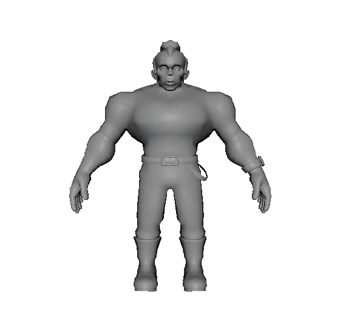

# maya-autorig

**[English](#english) · [Castellano](#castellano)**

Marker-guided automatic rigging for Maya, on top of **AdvancedSkeleton**,
driven from an agent -- Codex or Claude Code -- through [DCC-MCP](https://github.com/dcc-mcp/dcc-mcp-maya).

```
markers.propose  ->  fit_from_markers  ->  build_rig  ->  bind_skin
                            |                                |
                       verify_fit                       verify_skin
                                                        attach_props
                                                        pose_gallery
```



*Maya's viewport, recorded frame by frame and sped up: the raw character,
`markers_propose` (X-ray, markers, mirror), a wrist and a knee dragged --
the other side follows --, fit, build, bind, and the finished rig crouching
on IK legs (the pelvis dropped, feet planted), from the front and the side.
About 10 seconds of machine time in real life.*

---

## English

Point it at a character mesh and it places the fit skeleton, builds the rig,
binds the skin and **proves** the result: every stage writes JSON and a
viewport capture, and the pipeline refuses to advance past a stage that failed
its own checks.

Written for game characters: 4 bones per vertex (Unity's Standard quality),
linear skinning, no dependency on a T-pose.

### What it does that a one-click auto-rigger does not

- **The markers are the pose.** Eight body markers (chin, groin, wrists,
  elbows, knees) are proposed from the mesh and can be dragged; the arm angle
  comes from where they are, so A-pose, T-pose and arms-down all work without
  a detector deciding for you.
- **Fingers come from the mesh.** The hand is sliced along its own axis and
  finger lobes are found as connected components of the mesh, so a five-finger
  hand gets five chains, a four-lobe glove gets four, and a mitten gets one.
  The thumb is identified separately, and the wrist is re-derived from the
  palm when the arm walk stopped inside a sleeve.
- **Eyes come from the mesh** too, when the model has eyeballs: a mirror pair
  of small closed shells inside the head beats any proportional guess.
- **Props ride a bone.** A bag, a bomb or a weapon keeps its own mesh and gets
  a one-influence bind to the bone whose segment runs closest; anything
  resting on the ground rides the root instead.
- **Nothing is asserted without evidence.** Each stage records what it
  measured, and the pictures are viewport X-ray captures with the joints and
  controls drawn through the mesh, meant to be read by a cheap reviewer model
  rather than loaded into your main context.
- **Grading is comparative.** The gauntlet holds a run against a yardstick rig
  *you* supply, row by row, with tolerances derived from that rig's own
  numbers. There is no invented threshold and no yardstick in this repo.

### Install -- paste the link to your agent

Open **Codex** or **Claude Code** and paste:

> Install https://github.com/chafamaster2000/maya-autorig and set it up for me.

The agent reads [`AGENTS.md`](AGENTS.md) and runs one command, which
installs everything installable and registers the `maya` MCP server in
**both** Codex and Claude Code. Paste the same link again later and the same
command **updates**: it compares the `VERSION` file in your clone with the
one on GitHub, pulls only when they differ, and tells you exactly what to
restart -- or that nothing needs a restart.

That command, if you would rather run it yourself:

| | |
|---|---|
| Windows | `powershell -ExecutionPolicy Bypass -c "irm https://raw.githubusercontent.com/chafamaster2000/maya-autorig/main/tools/bootstrap.ps1 \| iex"` |
| macOS / Linux | `curl -fsSL https://raw.githubusercontent.com/chafamaster2000/maya-autorig/main/install.sh \| bash` |
| from a clone | `install.bat` (double-click) or `./install.sh`; `-DryRun` / `--dry-run` shows what it would do |

It installs Python and Node.js when missing, the DCC-MCP packages, the Maya
adapter, this skill (the gateway copy and the agent-side `SKILL.md` in
`~/.codex/skills` and `~/.claude/skills`), and the Codex and Claude Code
CLIs with their `maya` entry. It does **not** install Maya or
AdvancedSkeleton: those are licensed products this script has no right to
fetch, and it tells you where to get them. Each agent CLI needs its own
login once.

It ends with **"What changed -> what to do"**: the restarts you owe (Maya if
the skill copy changed and it was open; a new Codex session if the server
was just added; `/mcp` in Claude Code), and nothing else. Full chain and
per-platform detail in [`docs/INSTALL.md`](docs/INSTALL.md).

**How long it takes.** Installing: about 5-10 minutes the first time (Python,
Node.js and the agent CLIs download), about a minute on later runs, a few
seconds when nothing changed. Rigging a character: about 10 seconds of
machine time from raw file to bound, verified rig (fit ~1 s, build ~5 s,
bind ~2 s on a 3.5k-vertex body), plus the minute or two you spend dragging
markers if you correct them.

### Use

```
markers_propose(mesh="Mesh", pose="A")     # drag the mk_* locators if needed
harness_run(mesh="Mesh")                   # fit -> build -> bind -> verify -> props
```

`markers_propose` puts the viewport in **marker mode**, Mixamo-style: X-ray
on, the body and its props on a reference layer so a click always lands on
a marker, camera from the front, Move tool armed, and left/right markers
mirrored both ways -- drag either side, the other follows -- while
`AutoRigMarkers.mirror` is on (it is by default). `harness_run` leaves the
mode once the skin is bound and verified: X-ray off, mesh selectable,
markers hidden. A stage failing before that keeps it, so you can re-drag.

or the whole thing from a raw file:

```
gauntlet_run(source="C:/path/character.fbx", pose="A")
```

`pose` is how the character stands in the file: `A` (arms down at an angle,
the common case), `T` (arms horizontal) or `down` (arms against the body).
Getting it wrong is not fatal: the markers carry the pose, not a detector.

Evidence lands in `autorig_evidence/<scene>/<run>/` **inside Maya's current
project**, which the skill asks Maya for rather than guessing: on a default
install that is `~/Documents/maya/projects/default`, and on Windows it follows
a redirected Documents folder (OneDrive, a roaming profile) instead of writing
somewhere Maya never looks. `MAYA_AUTORIG_EVIDENCE` overrides it.

### Requirements

- Maya 2022 or newer, with **AdvancedSkeleton 6.x** installed (it is content,
  not a package; set `ADVANCEDSKELETON_DIR` if it lives somewhere unusual).
- `dcc-mcp-maya` (pulls `dcc-mcp-core` and the `dcc-mcp-server` gateway).
- numpy, which ships inside Maya.

### Layout

```
skill/maya-autorig/     the skill: tools.yaml + scripts/ (the whole pipeline)
tools/                  installers, the portable reviewer (review_run.py) and operator helpers
AGENTS.md               what an agent (Codex, Claude Code) must do with this repo; CLAUDE.md imports it
VERSION                 the one version number every installed copy carries
docs/INSTALL.md         the MCP chain, end to end, per platform
```

### Notes

The rig itself is built by AdvancedSkeleton, which is commercial software by
Animation Studios and is not included or redistributed here. This project
automates driving it.

MIT licensed. See [`LICENSE`](LICENSE).

---

## Castellano

> **¿Sólo querés riggear tu personaje y listo? Andá a [`GUIA.md`](GUIA.md),
> que es esto mismo en cuatro pasos.**

Le apuntás a la malla de un personaje y coloca el esqueleto, arma el rig, pone
la piel y **demuestra** que salió bien: cada etapa deja un JSON con lo que
midió y una captura del viewport, y el pipeline no avanza sobre una etapa que
falló sus propios chequeos.

Pensado para personajes de juego: 4 huesos por vértice, que es la calidad
Standard de Unity, skinning lineal, y sin depender de una T-pose.

### Qué hace que un auto-rigger de un clic no hace

- **Los marcadores son la pose.** Ocho marcadores (mentón, entrepierna,
  muñecas, codos, rodillas) se proponen desde la malla y se pueden arrastrar.
  El ángulo del brazo sale de dónde están, así que A-pose, T-pose y brazos
  colgando funcionan sin que un detector decida por vos.
- **Los dedos salen de la malla.** La mano se corta en rodajas sobre su propio
  eje y los dedos se encuentran como componentes conexas del mesh: una mano de
  cinco dedos recibe cinco cadenas, un guante de cuatro lóbulos recibe cuatro,
  y un mitón recibe una. El pulgar se identifica aparte, y la muñeca se
  recalcula desde la palma cuando la detección del brazo frenó dentro de una
  manga.
- **Los ojos también salen de la malla**, cuando el modelo los tiene: un par
  espejo de esferas cerradas dentro de la cabeza le gana a cualquier
  estimación por proporción.
- **Los accesorios van pegados a un hueso.** Una mochila, una bomba o un arma
  conservan su propia malla y reciben un bind de una sola influencia al hueso
  cuyo segmento pasa más cerca. Lo que está apoyado en el piso va a la raíz.
- **Nada se afirma sin evidencia.** Cada etapa registra lo que midió, y las
  imágenes son capturas del viewport en rayos X con los huesos y los controles
  dibujados a través del cuerpo, pensadas para que las lea un modelo revisor
  barato y no para cargarlas en tu contexto principal.
- **La calificación es comparativa.** El *gauntlet* mide una corrida contra un
  rig de referencia que **vos** elegís, fila por fila, con las tolerancias
  sacadas de los números de ese mismo rig. No hay umbrales inventados, y este
  repo no trae ninguna referencia adentro.

### Instalación -- pegale el link a tu agente

Abrí **Codex** o **Claude Code** y pegale:

> Instalá https://github.com/chafamaster2000/maya-autorig y dejámelo configurado.

El agente lee [`AGENTS.md`](AGENTS.md) y corre un solo comando, que instala
todo lo instalable y registra el servidor MCP `maya` en **los dos**, Codex y
Claude Code. Si más adelante volvés a pegar el mismo link, ese mismo comando
**actualiza**: compara el archivo `VERSION` de tu copia con el de GitHub,
baja los cambios sólo si son distintos, y te dice exactamente qué reiniciar
-- o que no hace falta reiniciar nada.

El comando, si preferís correrlo vos:

| | |
|---|---|
| Windows | `powershell -ExecutionPolicy Bypass -c "irm https://raw.githubusercontent.com/chafamaster2000/maya-autorig/main/tools/bootstrap.ps1 \| iex"` |
| macOS / Linux | `curl -fsSL https://raw.githubusercontent.com/chafamaster2000/maya-autorig/main/install.sh \| bash` |
| desde un clon | `install.bat` (doble clic) o `./install.sh`; `-DryRun` / `--dry-run` muestra qué haría |

Instala Python y Node.js si faltan, los paquetes DCC-MCP, el adapter de Maya,
esta herramienta (la copia para el gateway y el `SKILL.md` para el agente en
`~/.codex/skills` y `~/.claude/skills`), y los CLI de Codex y Claude Code con
su entrada `maya`. **No** instala Maya ni AdvancedSkeleton: son productos con
licencia que el script no tiene derecho a bajar, y te dice de dónde sacarlos.
Cada agente pide su login una vez.

Termina con **"What changed -> what to do"**: los reinicios que debés (Maya
si cambió la copia de la skill y estaba abierta; una sesión nueva de Codex si
recién se agregó el servidor; `/mcp` en Claude Code), y nada más. La cadena
completa está en [`docs/INSTALL.md`](docs/INSTALL.md).

**Cuánto tarda.** Instalar: unos 5-10 minutos la primera vez (bajan Python,
Node.js y los CLI de los agentes), un minuto las siguientes, unos segundos si
no cambió nada. Riggear un personaje: unos 10 segundos de máquina desde el
archivo crudo hasta el rig atado y verificado (fit ~1 s, build ~5 s, bind
~2 s en un cuerpo de 3.500 vértices), más el minuto o dos que tardes en
mover markers si los corregís.

### Uso

```
markers_propose(mesh="Mesh", pose="A")     # arrastrá los locators mk_* si hace falta
harness_run(mesh="Mesh")                   # fit -> build -> bind -> verify -> props
```

`markers_propose` deja el viewport en **modo markers**, estilo Mixamo: rayos
X, el cuerpo y sus props en una layer de referencia para que el clic caiga
siempre en un marker, cámara de frente, herramienta Move lista, y los
markers izquierdo/derecho espejados en los dos sentidos -- arrastrás
cualquiera y el otro lo sigue -- mientras `AutoRigMarkers.mirror` esté
prendido (viene prendido). `harness_run` sale del modo cuando la piel quedó
atada y verificada: rayos X apagados, malla seleccionable, markers ocultos.
Si una etapa falla antes, el modo se queda, así podés volver a arrastrar.

o todo de una desde el archivo crudo:

```
gauntlet_run(source="C:/ruta/personaje.fbx", pose="A")
```

`pose` es cómo está parado el personaje en el archivo: `A` (brazos en
diagonal hacia abajo, lo más común), `T` (brazos horizontales) o `down`
(brazos pegados al cuerpo). Errarle no es grave: la pose la llevan los
marcadores, no un detector.

Las evidencias quedan en `autorig_evidence\<escena>\<corrida>\` **adentro del
proyecto actual de Maya**, que la skill le pregunta a Maya en vez de adivinar:
en una instalación por defecto eso es `Documentos\maya\projects\default`, y
en Windows sigue la carpeta Documentos aunque esté redirigida (OneDrive, perfil
móvil), en vez de escribir en un lugar donde Maya nunca mira. Se cambia con
`MAYA_AUTORIG_EVIDENCE`.

### Requisitos

- Maya 2022 o más nuevo, con **AdvancedSkeleton 6.x** instalado (es contenido,
  no un paquete; usá `ADVANCEDSKELETON_DIR` si lo tenés en una carpeta rara).
- `dcc-mcp-maya` (arrastra `dcc-mcp-core` y el gateway `dcc-mcp-server`).
- numpy, que ya viene adentro de Maya.

### Estructura

```
skill/maya-autorig/     la skill: tools.yaml + scripts/ (todo el pipeline)
tools/                  instaladores y utilidades de operación
docs/INSTALL.md         la cadena MCP completa, por plataforma
```

### Notas

El rig lo arma AdvancedSkeleton, que es software comercial de Animation
Studios y no está incluido ni redistribuido acá. Este proyecto automatiza
manejarlo.

Licencia MIT. Ver [`LICENSE`](LICENSE).
